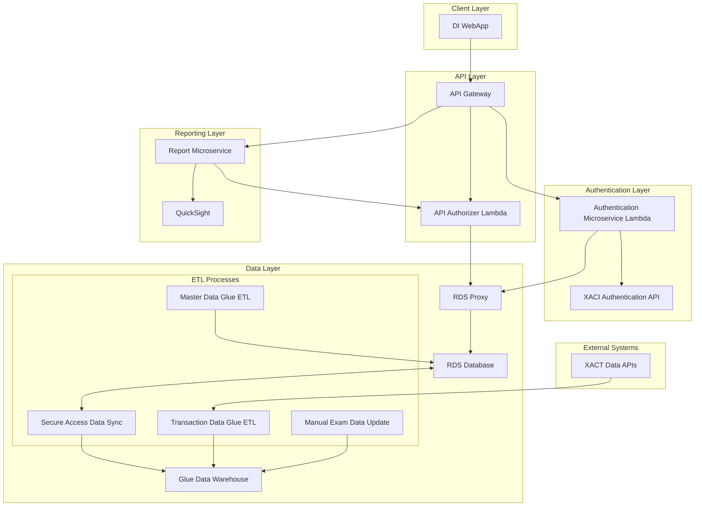

```mermaid
graph TD
    subgraph "Client Layer"
        DIWebApp[DI WebApp]
    end
    
    subgraph "API Layer"
        APIGateway[API Gateway]
        APIAuth[API Authorizer Lambda]
    end
    
    subgraph "Authentication Layer"
        AuthMicro[Authentication Microservice Lambda]
        XACIAuth[XACI Authentication API]
    end
    
    subgraph "Reporting Layer"
        ReportMicro[Report Microservice]
        QS[QuickSight]
    end
    
    subgraph "Data Layer"
        RDSProxy[RDS Proxy]
        RDS[RDS Database]
        DW[Glue Data Warehouse]
        
        subgraph "ETL Processes"
            TransETL[Transaction Data Glue ETL]
            MasterETL[Master Data Glue ETL]
            SecureSync[Secure Access Data Sync]
            ManualUpdate[Manual Exam Data Update]
        end
    end
    
    subgraph "External Systems"
        XACTDataAPI[XACT Data APIs]
    end
    
    DIWebApp --> APIGateway
    
    APIGateway --> AuthMicro
    APIGateway --> ReportMicro
    APIGateway --> APIAuth
    
    AuthMicro --> XACIAuth
    AuthMicro --> RDSProxy
    APIAuth --> RDSProxy
    
    ReportMicro --> QS
    ReportMicro --> APIAuth
    
    RDSProxy --> RDS
    RDS <--> SecureSync
    SecureSync --> DW
    TransETL --> DW
    MasterETL --> RDS
    ManualUpdate --> DW
    
    XACTDataAPI --> TransETL

```
