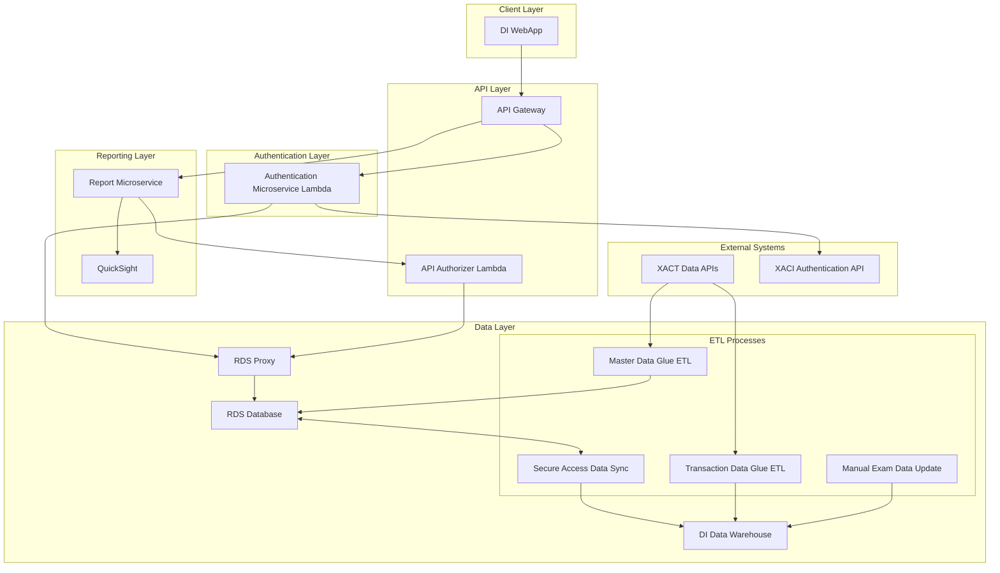
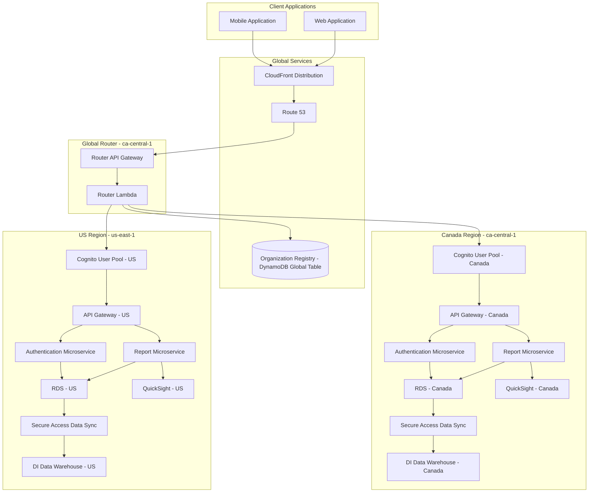
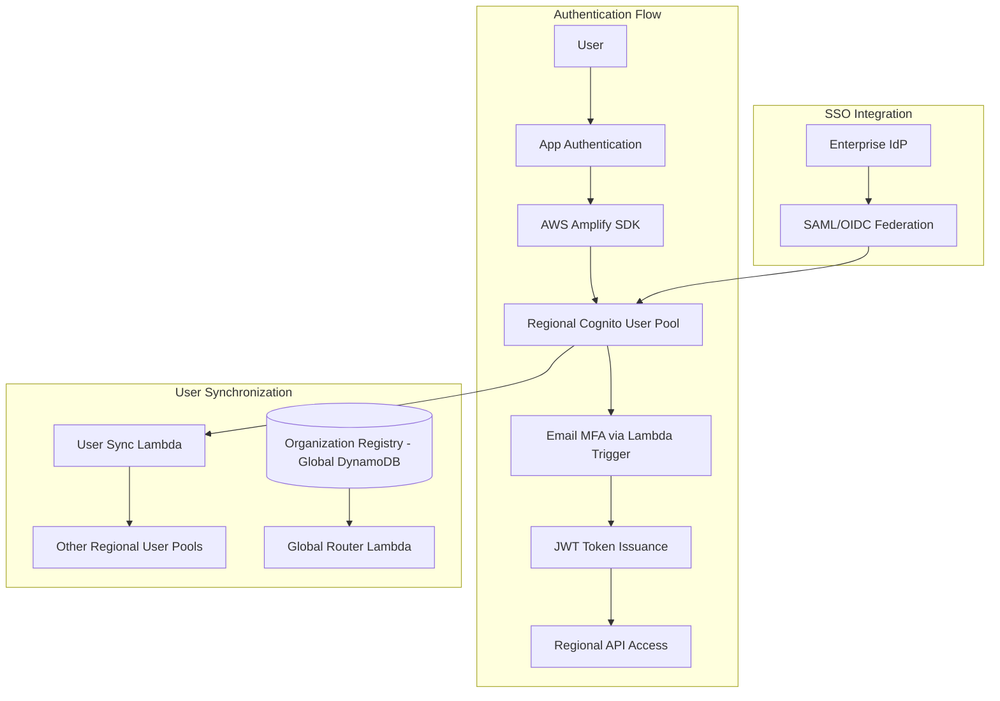

## Detailed System Architecture

# Improved Multi-Region Architecture for MFIQ

## Key Architecture Improvements

Based on the current architecture and requirements for global scaling with data residency compliance, the following improvements are recommended:

## 1. Multi-Region Architecture with Global Router

## 2. Cognito-Based Authentication System

## Key Improvements

### 1. Global Routing Layer

**Current Issue:** No clear strategy for routing users to their region-specific resources.

**Improvement:**
- Implement a global router in a primary region (ca-central-1)
- Use Route 53 and CloudFront for global distribution
- Store organization-to-region mapping in DynamoDB Global Tables
- Router Lambda determines the correct region for each user/organization

**Benefits:**
- Single entry point for all users regardless of region
- Transparent redirection to region-specific resources
- Maintains data residency by routing to appropriate regional stack

### 2. Cognito-Based Authentication

**Current Issue:** Custom authentication system lacks scalability and SSO capabilities.

**Improvement:**
- Replace custom Laravel authentication with Cognito User Pools in each region
- Implement custom Lambda triggers to maintain email-based MFA
- Use Cognito groups and attributes to store organization, business units, locations, and roles
- Enable SAML/OIDC federation for future SSO requirements

**Benefits:**
- Managed authentication service with built-in security features
- Support for future SSO requirements
- Consistent authentication experience across regions
- Reduced maintenance burden for authentication code

### 3. Regional Data Isolation

**Current Issue:** No clear strategy for maintaining data residency requirements.

**Improvement:**
- Deploy complete application stacks in each region
- Maintain strict data isolation between regions
- Use Global DynamoDB table only for routing metadata, not customer data
- Regional QuickSight instances for reporting

**Benefits:**
- Clear data residency boundaries
- Compliance with regional data requirements
- Improved performance for users in each region

### 4. API Gateway Standardization

**Current Issue:** Inconsistent use of API Gateway across the application.

**Improvement:**
- Standardize on API Gateway for all API interactions
- Implement API Gateway Authorizers using Cognito
- Use regional API Gateways with consistent API definitions
- Implement API Gateway resource policies for additional security

**Benefits:**
- Consistent API management across regions
- Improved security with standardized authorization
- Better monitoring and throttling capabilities
- Simplified client integration

### 5. Enhanced ETL Processes

**Current Issue:** ETL processes need to be region-aware.

**Improvement:**
- Deploy ETL processes in each region
- Maintain region-specific data pipelines
- Use AWS Glue for all ETL processes
- Implement consistent tagging for regional resources

**Benefits:**
- Data processing remains within regional boundaries
- Simplified compliance with data residency requirements
- Consistent ETL approach across regions

## Implementation Roadmap

### Phase 1: Global Routing Infrastructure
1. Implement DynamoDB Global Table for organization registry
2. Develop Router Lambda function
3. Set up Route 53 and CloudFront distribution
4. Test routing logic with mock endpoints

### Phase 2: Cognito Implementation
1. Set up Cognito User Pools in each region
2. Develop custom Lambda triggers for email MFA
3. Implement user attribute synchronization between regions
4. Migrate users from existing authentication system

### Phase 3: Regional API Standardization
1. Define consistent API specifications
2. Implement regional API Gateways
3. Configure Cognito authorizers
4. Update client applications to use new authentication flow

### Phase 4: Data Layer Isolation
1. Ensure complete data isolation between regions
2. Implement regional ETL processes
3. Set up regional QuickSight instances
4. Validate data residency compliance

### Phase 5: SSO Integration
1. Configure SAML/OIDC federation in Cognito
2. Test with enterprise identity providers
3. Document SSO integration process for customers

## Security Considerations

1. **Token Handling**
   - Implement secure token storage in client applications
   - Configure appropriate token expiration times
   - Use refresh tokens for seamless user experience

2. **Cross-Region Access Control**
   - Strictly enforce region boundaries for data access
   - Implement additional checks in API authorizers
   - Log and alert on cross-region access attempts

3. **Monitoring and Auditing**
   - Set up CloudTrail logging for authentication events
   - Implement CloudWatch alarms for suspicious activities
   - Create dashboards for authentication metrics

4. **Data Protection**
   - Encrypt all data at rest and in transit
   - Implement least privilege access for all components
   - Regular security reviews and penetration testing
