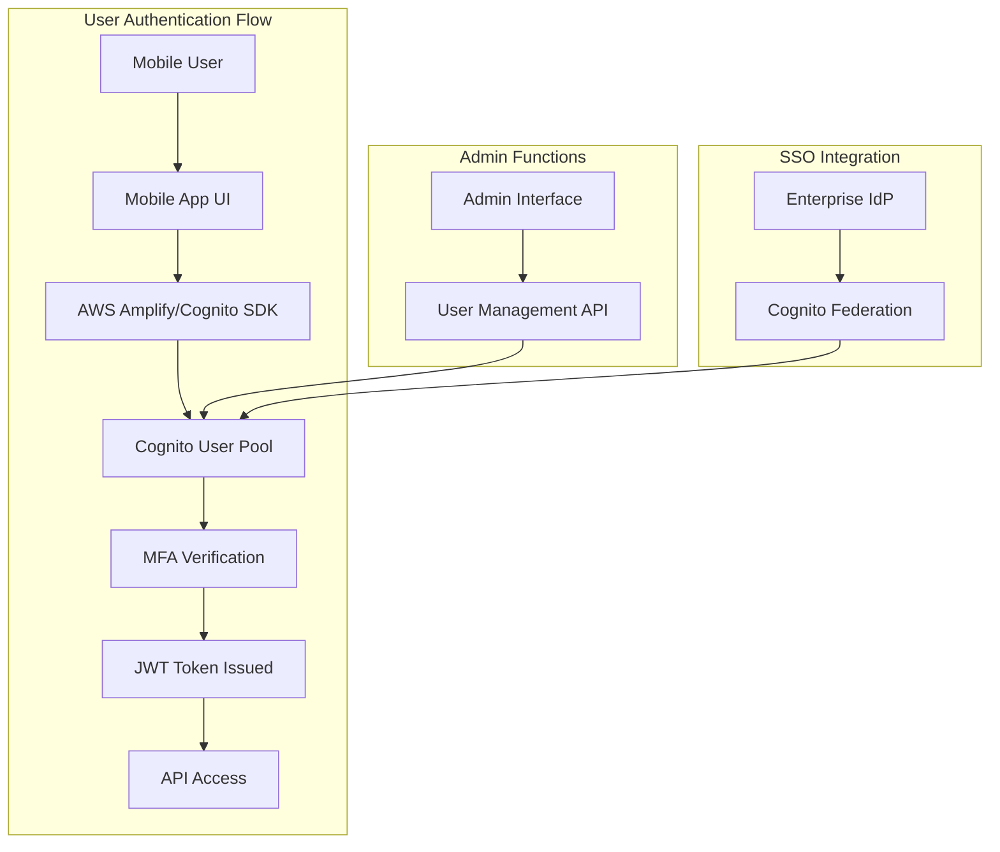
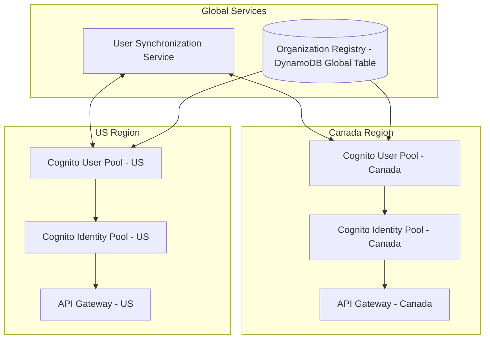

# Cognito/SSO Strategy for ###

## Current Authentication System

### Customer currently uses a custom authentication system built on Laravel:
- Username/password capture via API backend
- MFA code sent via email (Mailgun)
- JWT Access Token issued upon successful authentication
- All authentication currently in ca-central-1 region
- Authorization based on device ID, device type, and Access token

## Proposed Cognito Implementation

## Multi-Region Authentication Architecture

## Key Components

### 1. Cognito User Pools

Regional user directories that will replace the current custom authentication system:

- **User Management**:
  - Store user profiles and credentials
  - Handle user registration and account recovery
  - Manage user attributes including organization, business units, locations, and roles

- **Authentication Features**:
  - Multi-factor authentication (MFA) via SMS or email
  - Customizable authentication flows
  - Password policies and account lockout
  - JWT token issuance with configurable expiration

- **Security**:
  - Advanced security features including adaptive authentication
  - Protection against brute force attacks
  - Compromised credential checking

### 2. Cognito Identity Pools

Provide temporary AWS credentials for accessing AWS services:

- **Fine-grained Access Control**:
  - Role-based access to AWS resources
  - Dynamic role assignment based on user claims
  - Integration with API Gateway for authorization

- **Guest Access**:
  - Support for unauthenticated access where needed
  - Limited permissions for guest users

### 3. User Directory Synchronization

Ensures consistent user data across regions:

- **Lambda-based Synchronization**:
  - Triggered by user pool events (create, update, delete)
  - Propagates changes to other regional user pools
  - Maintains consistency of user attributes

- **Conflict Resolution**:
  - Last-writer-wins strategy for attribute updates
  - Logging of synchronization conflicts for review

### 4. SSO Integration (Future Capability)

Support for enterprise identity federation:

- **Identity Provider Integration**:
  - SAML 2.0 support for enterprise IdP integration
  - OpenID Connect (OIDC) support
  - Social identity provider integration if needed

- **Single Sign-On Experience**:
  - Seamless authentication across web and mobile
  - Consistent user experience
  - Session management and token refresh

## Migration Strategy

### Phase 1: Parallel Authentication Systems

1. **Set Up Cognito Infrastructure**:
   - Create user pools in each region
   - Configure security settings and password policies
   - Set up MFA similar to current email-based approach

2. **Implement User Synchronization**:
   - Develop Lambda functions for cross-region synchronization
   - Test synchronization with sample users
   - Implement monitoring and alerting

3. **Integrate Mobile App with Cognito**:
   - Add AWS Amplify SDK to mobile app
   - Implement dual authentication paths (legacy and Cognito)
   - Test authentication flows end-to-end

### Phase 2: User Migration

1. **Bulk User Import**:
   - Export users from existing database
   - Import users to Cognito user pools
   - Generate temporary passwords or password reset emails

2. **Gradual Cutover**:
   - Roll out Cognito authentication to a subset of users
   - Monitor for issues and user feedback
   - Gradually increase percentage of users on Cognito

3. **Complete Migration**:
   - Switch all authentication to Cognito
   - Maintain legacy system in read-only mode temporarily
   - Decommission legacy authentication after validation period

### Phase 3: SSO Implementation

1. **Enterprise IdP Integration**:
   - Configure SAML/OIDC providers in Cognito
   - Develop and test federation flows
   - Create documentation for enterprise customers

2. **User Attribute Mapping**:
   - Map enterprise IdP attributes to Cognito attributes
   - Configure role mapping for authorization
   - Test end-to-end SSO experience

## Security Considerations

### Data Protection

- **Encryption**: All user data encrypted at rest and in transit
- **Sensitive Attributes**: Sensitive user attributes marked as write-only
- **Token Handling**: Secure token storage in mobile app using platform security features

### Compliance

- **SOC 2 Compliance**: Maintain compliance through:
  - Comprehensive logging of authentication events
  - Regular security reviews and penetration testing
  - Monitoring and alerting for suspicious activities

- **Data Residency**: Ensure user authentication data remains in the appropriate region
  - User pool region selection based on organization's data residency requirements
  - Synchronization respects data residency boundaries

### Monitoring and Auditing

- **CloudWatch Metrics**:
  - Authentication success/failure rates
  - MFA usage statistics
  - Token issuance and validation metrics

- **CloudTrail Logging**:
  - Administrative actions on user pools
  - Configuration changes
  - API calls for user management

## Conclusion

The proposed Cognito/SSO strategy provides customer with a robust, scalable authentication solution that addresses current limitations while enabling future capabilities like enterprise SSO. The multi-region approach ensures data residency requirements are met while providing a seamless authentication experience for users regardless of their location or organization's chosen region.
