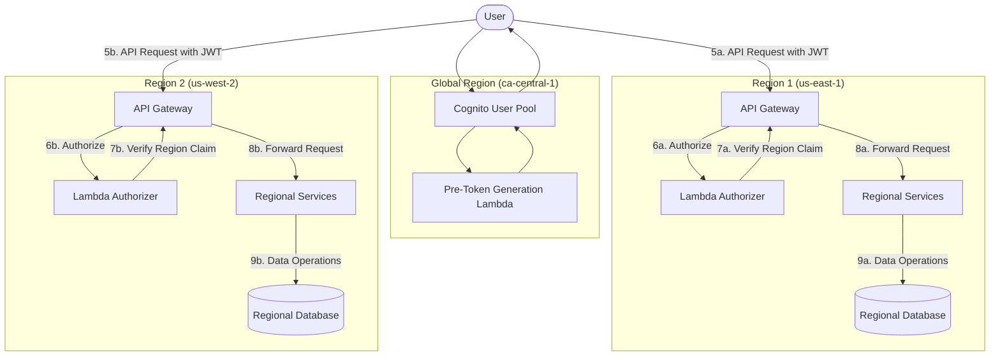

## Architecture Diagram

```mermaid
flowchart TB
    User([User])
    
    subgraph "Global Region (ca-central-1)"
        Cognito[Cognito User Pool]
        PreTokenLambda[Pre-Token Generation Lambda]
    end
    
    subgraph "Region 1 (us-east-1)"
        APIGateway1[API Gateway]
        Authorizer1[Lambda Authorizer]
        Services1[Regional Services]
        Database1[(Regional Database)]
    end
    
    subgraph "Region 2 (us-west-2)"
        APIGateway2[API Gateway]
        Authorizer2[Lambda Authorizer]
        Services2[Regional Services]
        Database2[(Regional Database)]
    end
    
    User --> Cognito
    Cognito --> PreTokenLambda
    PreTokenLambda --> Cognito
    Cognito --> User
    
    User -- "5a. API Request with JWT" --> APIGateway1
    User -- "5b. API Request with JWT" --> APIGateway2
    
    APIGateway1 -- "6a. Authorize" --> Authorizer1
    APIGateway2 -- "6b. Authorize" --> Authorizer2
    
    Authorizer1 -- "7a. Verify Region Claim" --> APIGateway1
    Authorizer2 -- "7b. Verify Region Claim" --> APIGateway2
    
    APIGateway1 -- "8a. Forward Request" --> Services1
    APIGateway2 -- "8b. Forward Request" --> Services2
    
    Services1 -- "9a. Data Operations" --> Database1
    Services2 -- "9b. Data Operations" --> Database2
    
    class User,Cognito,PreTokenLambda fill:#f9f,stroke:#333,stroke-width:2px
    class APIGateway1,Authorizer1,Services1,Database1 fill:#bbf,stroke:#333,stroke-width:2px
    class APIGateway2,Authorizer2,Services2,Database2 fill:#bfb,stroke:#333,stroke-width:2px
```
