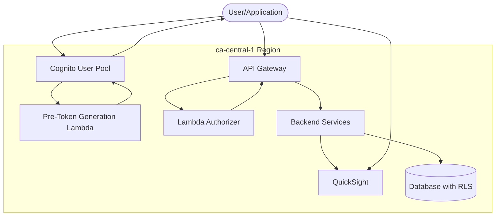

## Architecture Diagram

## Architecture Diagram

flowchart TB
    User([User/Application])
    
    subgraph "ca-central-1 Region"
        APIGateway[API Gateway]
        Authorizer[Lambda Authorizer]
        Cognito[Cognito User Pool]
        PreTokenLambda[Pre-Token Generation Lambda]
        Backend[Backend Services]
        QuickSight[QuickSight]
        Database[(Database with RLS)]
    end
    
    User -->|1. API Request with Credentials| APIGateway
    APIGateway -->|2. Authorize Request| Authorizer
    Authorizer -->|3. Authenticate User| Cognito
    Cognito -->|4. Trigger| PreTokenLambda
    PreTokenLambda -->|5. Add Claims| Cognito
    Cognito -->|6. Return Tokens| Authorizer
    Authorizer -->|7. Generate Policy| APIGateway
    APIGateway -->|8. Forward Request| Backend
    Backend -->|9. Query with Filters| Database
    Backend -->|10. Data for Dashboards| QuickSight
    
    class User fill:#f9f,stroke:#333,stroke-width:2px
    class APIGateway,Authorizer,Backend fill:#bbf,stroke:#333,stroke-width:2px
    class Cognito,PreTokenLambda fill:#fbb,stroke:#333,stroke-width:2px
    class QuickSight,Database fill:#bfb,stroke:#333,stroke-width:2px

