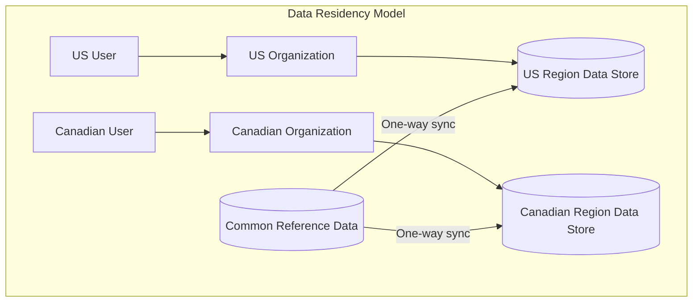
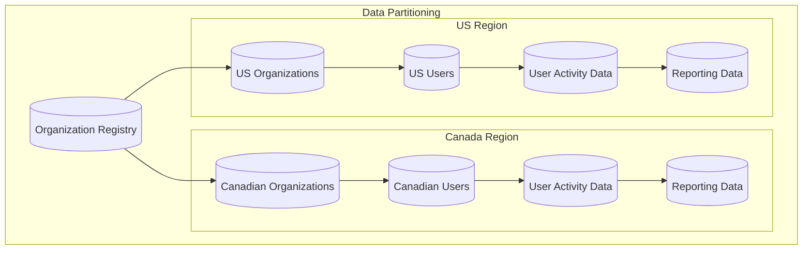
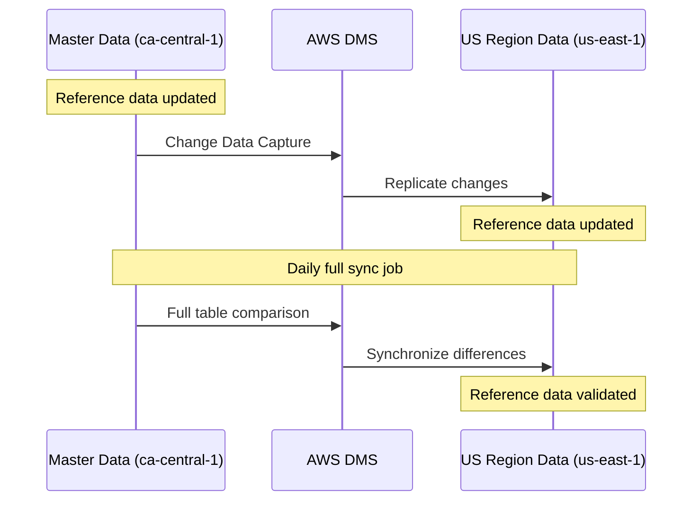
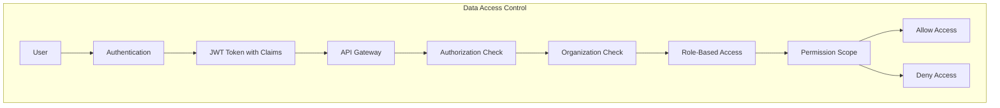
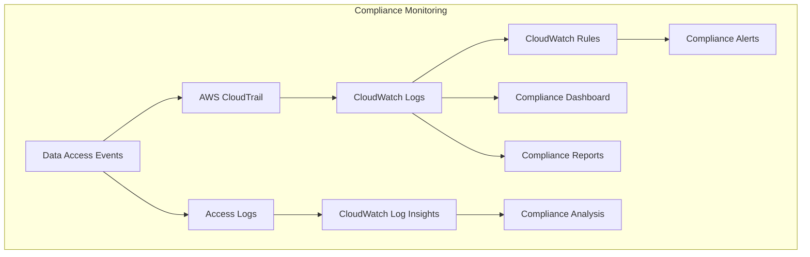

# Data Residency Compliance Strategy

## Overview

Data residency requirements mandate that an organization's data must be stored and processed within specific geographic boundaries. For customer1, this means ensuring that customer data for US organizations remains in US regions and Canadian organization data remains in Canadian regions, while maintaining a seamless user experience across the platform.

## Data Residency Requirements

## Key Principles

1. **Organization-Based Data Isolation**:
   - Each organization's data resides exclusively in their chosen region
   - No cross-region data storage for organization-specific data
   - Clear boundaries between regional data stores

2. **Common Reference Data Synchronization**:
   - Course content, assessment frameworks, and other reference data synchronized across regions
   - Master data maintained in ca-central-1 and replicated to other regions
   - One-way synchronization to ensure consistency

3. **User-to-Organization Binding**:
   - Users are associated with specific organizations
   - Authentication directs users to their organization's regional backend
   - Cross-organization access managed through explicit permissions

## Technical Implementation

### 1. Data Partitioning Strategy

- **Organization Registry**:
  - Global DynamoDB table storing organization metadata
  - Maps organization IDs to their designated AWS region
  - Used during authentication to route users to correct regional backend

- **Regional Data Stores**:
  - Separate RDS instances in each region
  - No cross-region replication of organization-specific data
  - Complete data isolation between regions

### 2. Reference Data Synchronization

- **AWS Database Migration Service (DMS)**:
  - Continuous replication for reference tables
  - One-way synchronization from master (ca-central-1) to other regions
  - Change Data Capture (CDC) for efficient updates

- **Reference Data Tables**:
  - Course content and metadata
  - Assessment frameworks and questions
  - System configuration parameters
  - Other non-organization-specific reference data

### 3. Data Access Controls

- **JWT Token Claims**:
  - Organization ID embedded in authentication token
  - User roles and permissions included as claims
  - Token issued by regional Cognito instance

- **API Authorization**:
  - API Gateway validates token and extracts claims
  - Organization ID verified against request context
  - Role-based access control enforced at API level

- **Database-Level Controls**:
  - Row-level security in PostgreSQL for analytics data
  - Application-enforced tenant isolation
  - Query filtering based on organization ID

## Compliance Monitoring and Auditing

- **Access Logging**:
  - Comprehensive logging of all data access events
  - API Gateway request logging
  - Database query logging for sensitive operations

- **Compliance Alerting**:
  - Automated detection of potential compliance violations
  - Alerts for cross-region data access attempts
  - Notification of configuration changes affecting data residency

- **Regular Auditing**:
  - Scheduled compliance reviews
  - Validation of data location and access patterns
  - Reports for SOC 2 compliance documentation

## Data Residency Validation

### Validation Mechanisms

1. **Automated Testing**:
   - Regular tests to verify data isolation
   - Validation of reference data synchronization
   - Confirmation of proper user routing based on organization

2. **Audit Trails**:
   - Comprehensive logs of data access and modification
   - Records of authentication and authorization decisions
   - Documentation of data flows for compliance verification

3. **Data Classification**:
   - Clear labeling of data by region and organization
   - Metadata tagging for data residency requirements
   - Automated enforcement of data movement restrictions

## Implementation Roadmap

### Phase 1: Data Segregation

1. **Organization Registry Setup**:
   - Create global DynamoDB table for organization metadata
   - Implement organization-to-region mapping
   - Develop lookup service for authentication flow

2. **Regional Database Deployment**:
   - Set up separate RDS instances in each region
   - Configure security groups and network isolation
   - Implement encryption for data at rest

3. **Data Migration Planning**:
   - Analyze existing data for regional assignment
   - Develop migration scripts with organization filtering
   - Test data migration process with sample data

### Phase 2: Reference Data Synchronization

1. **DMS Configuration**:
   - Set up AWS DMS replication instances
   - Configure replication tasks for reference tables
   - Implement monitoring for replication health

2. **Reference Data Management**:
   - Identify and tag reference data tables
   - Implement master data management processes
   - Develop procedures for reference data updates

3. **Synchronization Testing**:
   - Validate data consistency across regions
   - Test failure scenarios and recovery procedures
   - Measure replication latency and optimize as needed

### Phase 3: Access Control Implementation

1. **Token-Based Authorization**:
   - Update JWT token structure with organization claims
   - Implement token validation in API Gateway
   - Configure role-based access control

2. **Application Updates**:
   - Modify application code to enforce data residency
   - Implement organization context in all data access
   - Add validation checks for cross-organization requests

3. **Monitoring and Alerting**:
   - Set up CloudWatch dashboards for compliance monitoring
   - Configure alerts for potential violations
   - Implement regular compliance reporting

## Conclusion

The proposed data residency compliance strategy ensures that customer1 can meet regulatory requirements while providing a seamless user experience. By implementing strict data partitioning, controlled reference data synchronization, and comprehensive access controls, the architecture maintains clear boundaries between regional data stores while enabling efficient operation of the platform across multiple regions.
