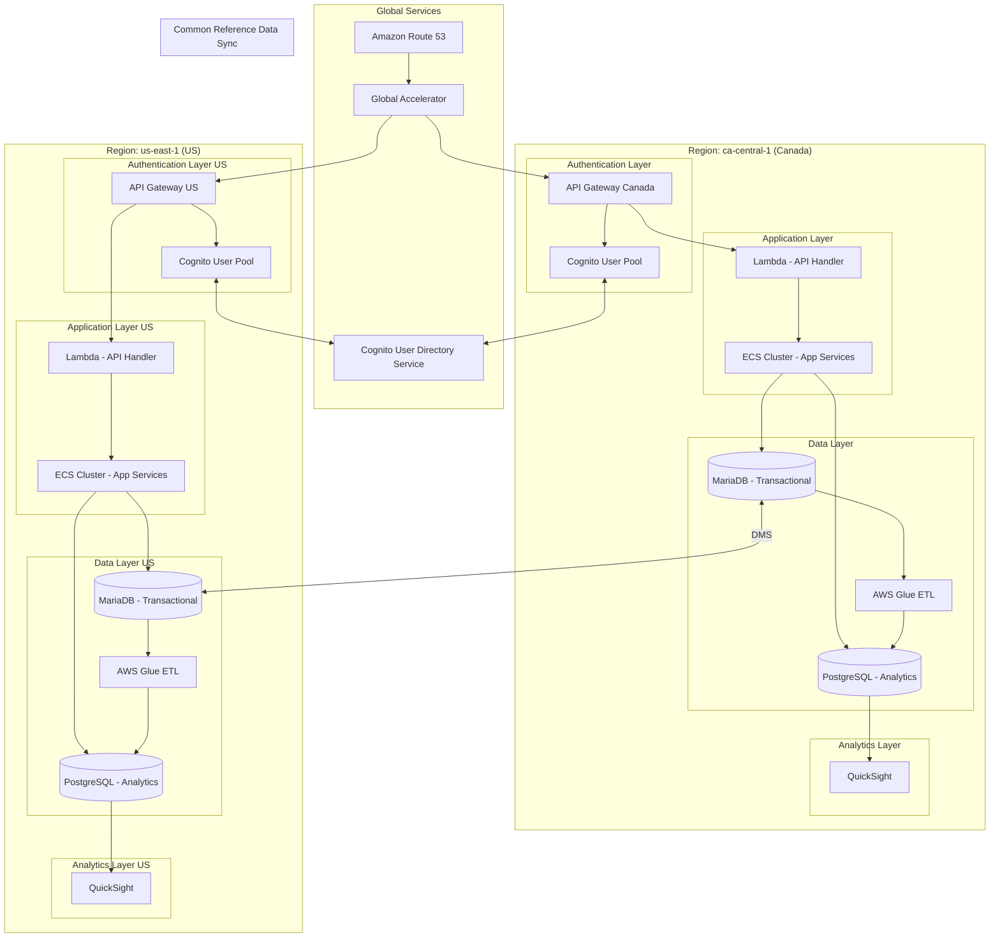
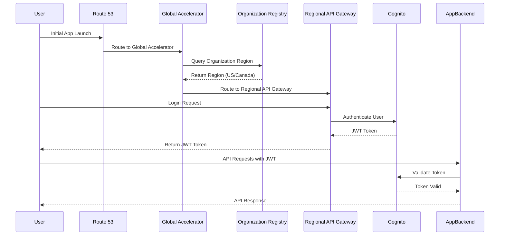
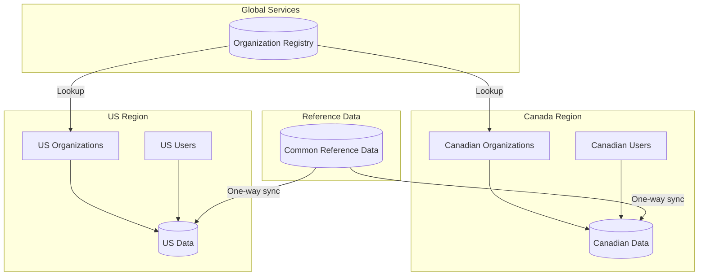
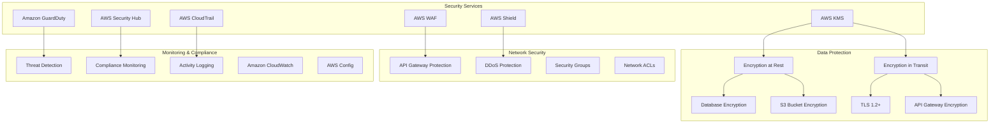

# customer1 Global Architecture Design

## Executive Summary

This document outlines a comprehensive architecture for  resilience mobile application, focusing on global scaling with specific attention to data residency requirements between the US and Canada. The architecture addresses authentication strategies using AWS Cognito, multi-region deployment, data isolation, and optimized regional routing.

## Current Architecture Overview

sample current architecture is deployed in the ca-central-1 region with:
- Custom authentication through API backend 
- MariaDB for transactional data storage
- PostgreSQL for analytics data
- ETL jobs using AWS Glue
- QuickSight for analytics and visualization
- Daily data refresh cycles

## Key Requirements

1. **Data Residency**: Organization data must reside in the region of choice (US or Canada)
2. **Authentication**: Need to modernize from custom solution to AWS-native services
3. **Global Scalability**: Architecture must support future expansion to other regions
4. **Security**: Maintain SOC 2 compliance across all regions
5. **Role-Based Access**: Support hierarchical access control for leaders
6. **SSO Support**: Future capability for enterprise customers

## Proposed Architecture

## Authentication Flow

## Data Residency Architecture

## Detailed Component Architecture

### 1. Global Routing Layer

- **Amazon Route 53**: Provides global DNS resolution
  - Geolocation routing policies to direct users to closest regional endpoint
  - Health checks to ensure high availability

- **AWS Global Accelerator**: Improves availability and performance
  - Static IP addresses for application endpoints
  - Traffic distribution across multiple regions
  - Fast regional failover capabilities

- **Organization Registry Service**: Lightweight global service to determine organization's region
  - Implemented as DynamoDB Global Table
  - Stores organization ID to region mapping
  - Used during authentication to route users to correct regional backend

### 2. Authentication & Authorization

- **Amazon Cognito User Pools**: Regional user directories
  - Store user credentials and profile information
  - Handle authentication flows including MFA
  - Issue JWT tokens for API authorization

- **Cognito User Directory Service**: Global user management service
  - Synchronizes user information across regional Cognito User Pools
  - Ensures users can authenticate regardless of entry point
  - Implemented using Lambda functions and DynamoDB Global Tables

- **Identity Federation**: Future capability
  - Support for SAML 2.0 and OpenID Connect
  - Integration with enterprise identity providers
  - Single Sign-On (SSO) capabilities

### 3. API Layer

- **Amazon API Gateway**: Regional REST API endpoints
  - JWT token validation using Cognito authorizers
  - Request routing to appropriate backend services
  - API throttling and quota management
  - CORS support for web applications

- **Lambda Edge Functions**: For initial routing decisions
  - Determine user's organization and appropriate region
  - Redirect to regional API Gateway as needed

### 4. Application Layer

- **ECS Clusters**: Container-based application services
  - Scalable and resilient application hosting
  - Microservices architecture for independent scaling
  - Auto-scaling based on demand

- **Lambda Functions**: Serverless API handlers
  - Process API requests from API Gateway
  - Implement business logic
  - Access data stores and external services

### 5. Data Layer

- **MariaDB (Amazon RDS)**: Transactional data store
  - Stores user data, activity records, and application state
  - Multi-AZ deployment for high availability
  - Encrypted at rest using AWS KMS

- **PostgreSQL (Amazon RDS)**: Analytics data store
  - Optimized for reporting and analytics queries
  - Stores aggregated and transformed data
  - Powers QuickSight dashboards and reports

- **AWS Glue**: ETL service
  - Transforms transactional data for analytics
  - Scheduled daily jobs for data refresh
  - Maintains data consistency across stores

- **AWS Database Migration Service (DMS)**: Reference data synchronization
  - One-way replication of common reference tables
  - Ensures consistency of reference data across regions

### 6. Analytics Layer

- **Amazon QuickSight**: Business intelligence and visualization
  - Leadership dashboards for organizational insights
  - Row-level security based on user roles
  - Embedded analytics for in-app reporting

## Security Architecture

## Implementation Recommendations

### Phase 1: Authentication Modernization

1. **Implement Cognito User Pools**:
   - Create regional user pools in ca-central-1 and us-east-1
   - Migrate existing users to Cognito User Pools
   - Implement MFA using Cognito's built-in capabilities

2. **Build Organization Registry**:
   - Create DynamoDB Global Table for organization-to-region mapping
   - Implement Lambda function for organization lookup
   - Integrate with authentication flow

3. **Update API Authentication**:
   - Implement Cognito authorizers in API Gateway
   - Update mobile app to use Cognito authentication flow
   - Test token validation and authorization

### Phase 2: Multi-Region Deployment

1. **Deploy US Region Infrastructure**:
   - Set up RDS instances in us-east-1
   - Deploy application services in US region
   - Configure API Gateway in US region

2. **Implement Global Routing**:
   - Configure Route 53 and Global Accelerator
   - Implement regional routing based on organization
   - Test cross-region authentication flows

3. **Set Up Data Synchronization**:
   - Configure DMS for reference data replication
   - Test data consistency across regions
   - Implement monitoring for replication health

### Phase 3: Analytics & Reporting

1. **Regional QuickSight Deployments**:
   - Set up QuickSight in each region
   - Configure row-level security based on user roles
   - Migrate existing dashboards and reports

2. **ETL Job Configuration**:
   - Set up regional Glue jobs
   - Configure data transformation workflows
   - Implement monitoring and alerting

## Conclusion

The proposed architecture provides customer1 with a scalable, secure, and compliant solution for global expansion while meeting data residency requirements. By leveraging AWS global services like Route 53 and Global Accelerator combined with regional services like Cognito and RDS, the architecture ensures optimal performance, security, and compliance across regions.

The phased implementation approach allows for gradual migration from the current architecture to the target state, minimizing disruption to existing users while enabling new capabilities and regional expansion.
