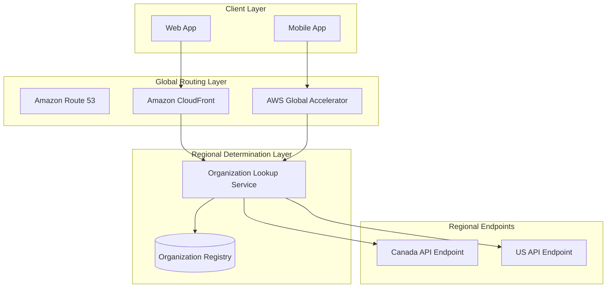
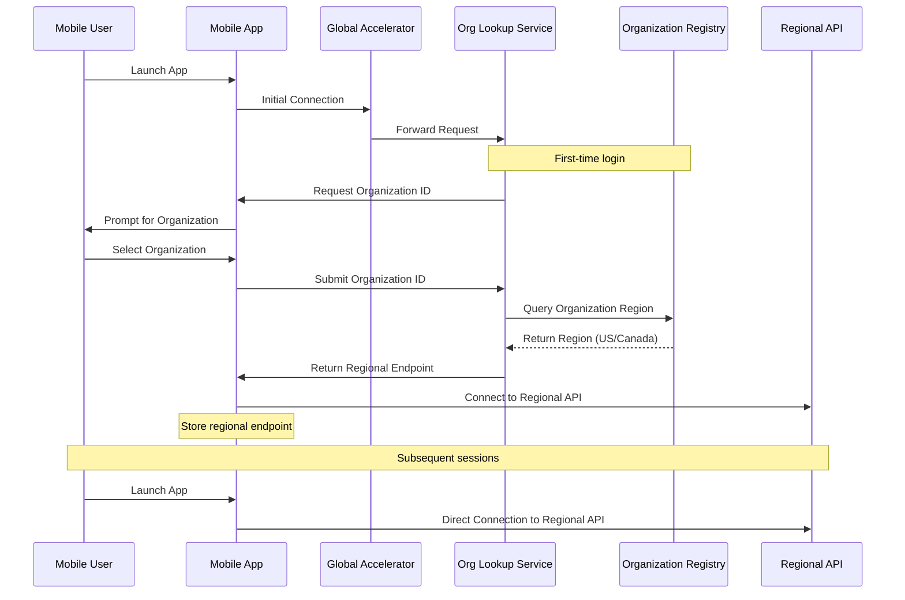
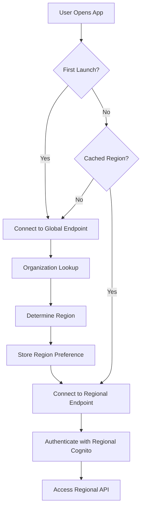
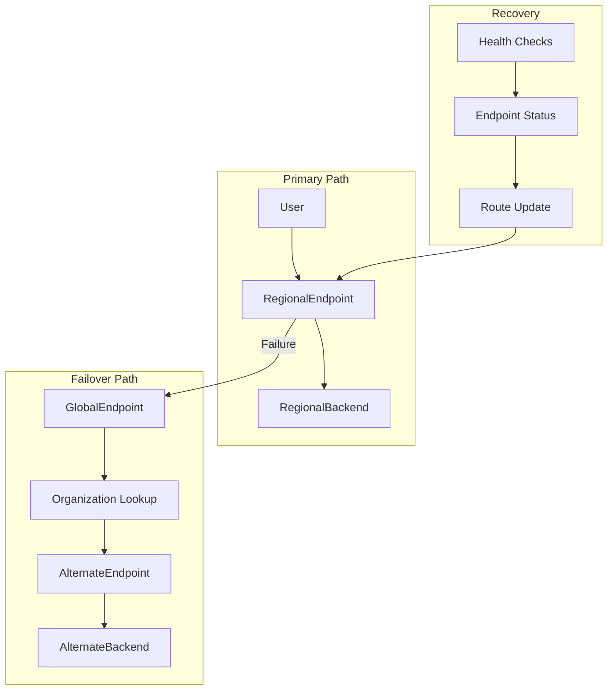
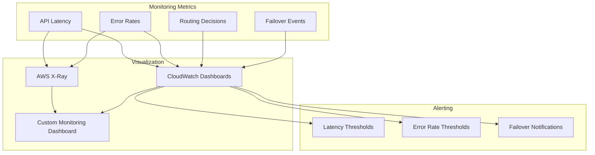

# Regional Routing Optimization Strategy

## Current Routing Challenge

customer currently operates in a single region (ca-central-1), but needs to expand to multiple regions while ensuring users are directed to the appropriate regional backend based on their organization's data residency requirements. This document outlines a strategy for optimizing regional routing to provide low-latency access while maintaining data residency compliance.

## Proposed Regional Routing Architecture

## Key Components

### 1. Global Entry Points

- **AWS Global Accelerator**:
  - Static IP addresses for mobile app connectivity
  - Anycast IP routing to nearest AWS edge location
  - TCP connection termination at the edge for reduced latency
  - Ideal for mobile applications with persistent connections

- **Amazon CloudFront**:
  - Content delivery network for web application assets
  - Edge caching of static content
  - Dynamic content routing based on request attributes
  - Lambda@Edge functions for routing logic

- **Amazon Route 53**:
  - Global DNS service with health checking
  - Geolocation and latency-based routing policies
  - Failover routing for high availability
  - Integration with Global Accelerator and CloudFront

### 2. Organization Lookup Service

- **Organization Registry**:
  - DynamoDB Global Table storing organization-to-region mappings
  - Low-latency lookups from any region
  - Cached results for improved performance

- **Lookup Service**:
  - Lambda function deployed in multiple regions
  - Determines appropriate regional endpoint based on organization ID
  - Caches results for frequent lookups
  - Handles authentication pre-routing

### 3. Regional API Endpoints

- **Amazon API Gateway**:
  - Regional API endpoints in each supported region
  - Custom domain names with regional certificates
  - Regional caching for improved performance
  - Integration with regional Cognito user pools

- **Regional Routing Rules**:
  - Organization-based routing to appropriate backend
  - JWT token validation specific to region
  - Error handling for misrouted requests

## Routing Optimization Techniques

### 1. Initial Routing Strategy

- **First-Time Access**:
  - User connects to global endpoint via Global Accelerator
  - Organization lookup determines appropriate region
  - App stores regional preference locally
  - Subsequent connections go directly to regional endpoint

- **Returning Users**:
  - App uses cached regional endpoint
  - Fallback to global endpoint if regional connection fails
  - Periodic validation of regional assignment

### 2. Connection Optimization

- **Persistent Connections**:
  - WebSocket connections for real-time features
  - Connection pooling for API requests
  - Keepalive settings optimization

- **Request Batching**:
  - Group multiple API requests where possible
  - Reduce connection establishment overhead
  - Optimize for mobile network conditions

- **Predictive Prefetching**:
  - Anticipate user needs based on behavior
  - Prefetch likely-needed data during idle periods
  - Cache data locally for offline access

### 3. Failover and Resilience

- **Health Checking**:
  - Regular health checks of regional endpoints
  - Automated failover to alternate endpoints
  - Recovery detection and route restoration

- **Circuit Breaking**:
  - Detect failing endpoints quickly
  - Prevent cascading failures
  - Graceful degradation of service

- **Regional Fallbacks**:
  - Predefined fallback regions for each primary region
  - Temporary access to data in alternate region if necessary
  - Clear user notification of temporary routing changes

## Implementation Plan

### Phase 1: Global Routing Infrastructure

1. **Set Up Global Accelerator**:
   - Configure static IP addresses
   - Set up listener configurations
   - Implement initial endpoint groups

2. **Deploy Organization Lookup Service**:
   - Create DynamoDB Global Table for organization registry
   - Implement Lambda function for organization lookup
   - Set up CloudFront distribution with Lambda@Edge

3. **Configure Route 53**:
   - Set up DNS records for application endpoints
   - Configure health checks for regional endpoints
   - Implement routing policies

### Phase 2: Regional Endpoint Configuration

1. **Deploy Regional API Gateways**:
   - Set up API Gateway in each target region
   - Configure custom domain names
   - Implement regional caching

2. **Implement Regional Routing Logic**:
   - Develop routing rules based on organization ID
   - Configure JWT validation for each region
   - Set up error handling for misrouted requests

3. **Optimize Connection Parameters**:
   - Configure connection timeouts
   - Implement keepalive settings
   - Set up connection pooling

### Phase 3: Mobile App Updates

1. **Update Mobile App for Regional Awareness**:
   - Implement regional endpoint caching
   - Add logic for endpoint selection
   - Develop failover handling

2. **Optimize Network Usage**:
   - Implement request batching
   - Configure offline capabilities
   - Add predictive prefetching

3. **Test and Optimize**:
   - Conduct latency testing from various locations
   - Optimize routing based on real-world performance
   - Implement monitoring and alerting for routing issues

## Performance Monitoring

- **Key Metrics**:
  - API latency by region and endpoint
  - Connection success rates
  - Routing decision distribution
  - Failover frequency and duration

- **Real User Monitoring**:
  - Client-side performance tracking
  - Network condition correlation
  - User experience metrics

- **Continuous Optimization**:
  - Regular review of routing performance
  - A/B testing of routing strategies
  - Iterative improvements based on real-world data

## Conclusion

The proposed regional routing optimization strategy provides customer with a robust, efficient approach to directing users to the appropriate regional backend while maintaining low latency and high availability. By leveraging AWS global services like Global Accelerator and Route 53 combined with intelligent routing logic, the architecture ensures optimal performance while meeting data residency requirements.
